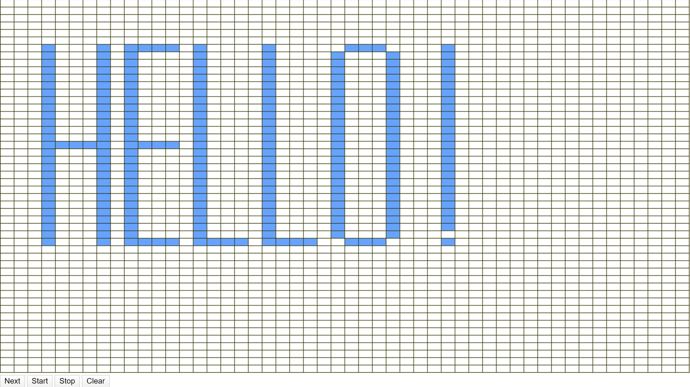
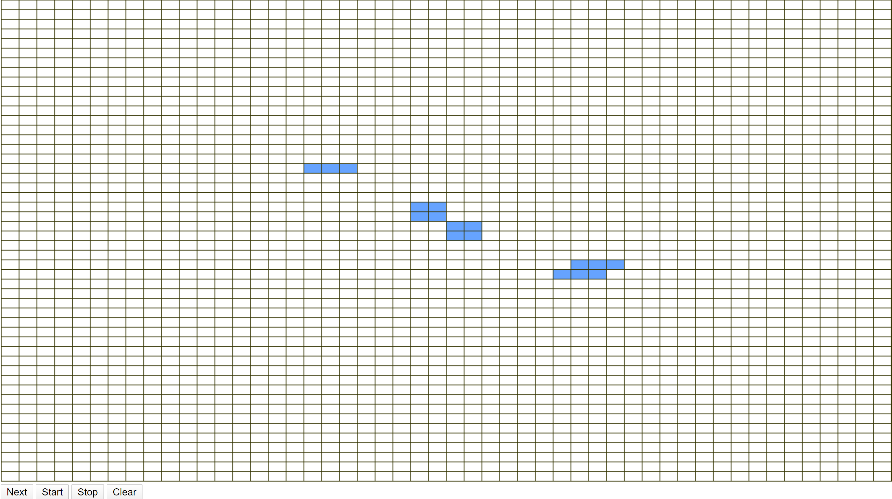
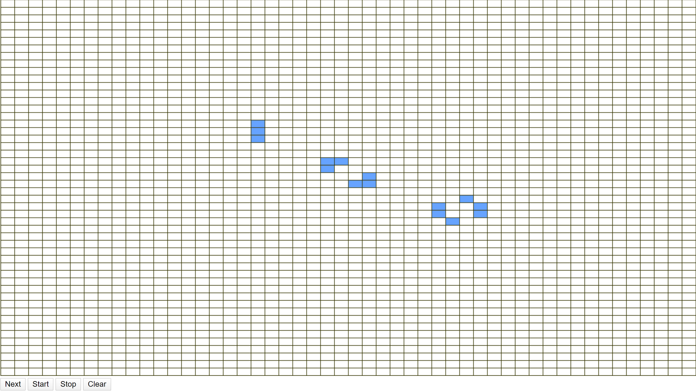

# Simple Game

It is Game of Life by Conway.

## Why is it Simple Game if it's just Conway's Game of Life

I saw a part of a Joe Rogan Podcast Episode with Lex Fridman. He mentioned how simple [Conway's *Game of Life*](https://en.wikipedia.org/wiki/Conway's_Game_of_Life) starts yet complex it can end up. I figured I would try to make my own simple simulation/game by only setting simple initial parameters and letting the game run. I did not get to the other games and only did Game of Life with no modifications!

## Requirements
1. Node.js
2. npm

## Run File
1. Clone Repository
2. Run `npm install`
3. Run `npm run start`
4. Go to **localhost:3000**

## I'm here now what
Click on squares to mark them as *Alive* or *Dead* and when you're ready click *Next* or *Start*.
*Next* moves 1 step and *Start* moves forever (or until no cells are alive). *Stop* will pause the simulation
while *Clear* will end the simulation and clear all the cells!

## Wow I noticed how Reactive this is!
Thank you! I really worked hard on making it reactive to changes in browser size!

## Anything else you can tell us?
You know what they say, a picture is worth 1000 words!

